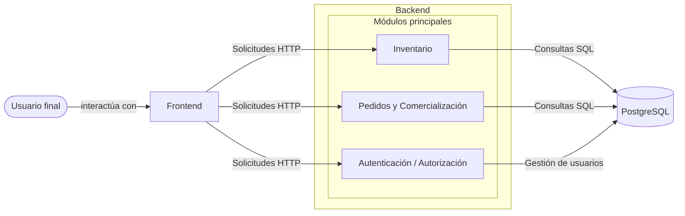

# Ecomindala — Transformación Digital de Inventario y Trazabilidad de Café

> **Caso de estudio** del análisis, diseño y desarrollo de un sistema de gestión de inventarios y trazabilidad de café para **Ecomindala S.A.S.**, una comercializadora de cafés especiales en Pasto, Colombia.

> **El código fuente no está incluido.**
>
> El software fue desarrollado para Ecomindala S.A.S. como parte de mi proyecto de pasantía de pregrado. Por consideraciones de propiedad y confidencialidad, este repositorio documenta el proceso de ingeniería, la arquitectura, las decisiones de diseño y los resultados, sin publicar el código fuente.

---

# Resumen

Este repositorio documenta el proceso completo de ingeniería de software detrás de la transformación digital de las operaciones internas de inventario de Ecomindala.

En lugar de empezar por el desarrollo de software, el proyecto inició entendiendo el flujo operativo de la empresa, documentando los procesos manuales, evaluando soluciones de inventario existentes, y diseñando un sistema hecho a la medida de las necesidades específicas de la empresa.

El resultado fue una plataforma interna capaz de gestionar proveedores, fincas, lotes de café, generación automática de productos, inventario basado en peso, pedidos de clientes, roles de usuario, reportes, y trazabilidad del producto desde el proveedor hasta la finca y el producto final. Cada lote además lleva su propio análisis sensorial, de modo que el perfil de sabor de cualquier lote o producto está a un clic.

---

---

# Capturas de pantalla

## Inicio de sesión y Panel de control

Login

## Módulos clave

Users

Inventory

Coffe Lots

Movimientos y trazabilidad

Orders

Suppliers

Reports

---

# Aportes clave

- Analicé y documenté procesos de negocio que antes se manejaban de forma verbal y en registros en papel.
- Estandaricé los flujos operativos antes de digitalizarlos.
- Evalué siete soluciones existentes de gestión de inventario usando criterios técnicos ponderados.
- Diseñé la arquitectura del software y el modelo de base de datos.
- Desarrollé la plataforma interna de inventario y trazabilidad usando Django y PostgreSQL.
- Implementé autenticación y autorización basada en roles para cuatro roles: Administrador, Recepcionista, Despachador y Cliente.
- Diseñé un motor de generación automática de productos: registrar un solo lote de café crea las 36 variantes de producto vendibles (pergamino seco, verde y tostado, según peso, nivel de tueste y presentación en grano o molido) con precios calculados automáticamente.
- Modelé el inventario a nivel de lote: al despachar un pedido se descuenta el peso de cada producto del peso restante de su propio lote, ajustado por la pérdida del proceso (trillado o tostión) que aplica a esa presentación, y cada cambio queda registrado como un movimiento de inventario auditable.
- Construí el módulo de gestión de pedidos: ciclo de estados, validación de stock, flujo del despachador y notificaciones por correo.
- Estructuré el análisis sensorial de cada lote (notas de cata, puntaje de taza, observaciones) para que clientes y personal vean el perfil de sabor de cada lote junto con sus datos de origen.
- Construí paneles de reportes con exportación a PDF.
- Validé el sistema mediante pruebas funcionales, pruebas piloto y una encuesta de satisfacción con usuarios reales.

---

# Contexto de negocio

Ecomindala gestionaba la mayoría de sus operaciones diarias de forma manual.

Los movimientos de inventario, la información de proveedores, el registro de productos y los procedimientos operativos dependían de mensajes, registros manuscritos y comunicación verbal.

Esto generaba varios problemas:

- Falta de procesos estandarizados
- Control de inventario manual
- Ausencia de información centralizada
- Trazabilidad limitada del producto
- Errores humanos en las operaciones diarias
- Capacidades de reporte limitadas
- Sin control de acceso basado en roles

El objetivo del proyecto no era simplemente construir software, sino digitalizar y estandarizar el flujo operativo de la empresa.

---

# Mi rol

Trabajé como pasante de Ingeniería de Sistemas dentro del área de Investigación, Desarrollo e Innovación.

Mis responsabilidades incluyeron:

- Análisis de negocio
- Ingeniería de requisitos
- Documentación de procesos
- Evaluación de tecnologías
- Modelado del sistema
- Diseño de base de datos
- Desarrollo backend
- Pruebas con usuarios

### Alcance del proyecto

Otro pasante y yo trabajamos en el mismo proyecto Django, con una división clara de responsabilidades:

- **Mi parte:** la plataforma interna de gestión — usuarios y roles, proveedores, fincas, lotes, generación automática de productos, inventario, gestión de pedidos (ciclo de estados, descuento de stock, despacho, notificaciones) y reportes.
- **Parte del otro pasante:** la tienda en línea orientada al cliente, incluyendo el carrito de compras y las vistas de la tienda. Acordamos juntos cómo se estructuraría el análisis sensorial de un lote, y la tienda muestra esa información a los clientes.

---

# Antes → Después

| Antes | Después |
|---------|--------|
| Procedimientos operativos verbales | Flujos digitales estandarizados |
| Registros de inventario manuales | Inventario centralizado basado en peso, con historial auditable de movimientos |
| Registro manual de productos y presentaciones | 36 productos generados automáticamente por lote, con precios calculados |
| Sin separación de roles | Autenticación y permisos basados en roles |
| Sin trazabilidad del café | Trazabilidad Proveedor → Finca → Lote → Producto |
| Reportes manuales | Reportes de inventario y operativos con exportación a PDF |
| Información desconectada | Plataforma de gestión integrada |

---

# Investigación y decisión técnica

Antes de desarrollar una solución propia, se evaluaron siete plataformas de gestión de inventario.

| Solución | Puntaje |
|----------|------:|
| Odoo | 58.00 |
| Zoho | 54.75 |
| Factora POS | 52.00 |
| InvenTree | 48.75 |
| Inventory CGI5 | 48.00 |
| Inventory (Laravel) | 48.00 |
| Novatecs Excel | 30.75 |

Criterios de evaluación:

- Funcionalidad
- Costo
- Facilidad de uso
- Escalabilidad
- Seguridad
- Soporte técnico
- Flexibilidad de reportes

Aunque las soluciones comerciales obtuvieron puntajes más altos, ninguna permitía el nivel de personalización que requería Ecomindala.

Por eso, se desarrolló una plataforma propia usando Django, PostgreSQL y AdminLTE 3 (ver [Tecnologías](#tecnologías)).

Este enfoque eliminó costos de licenciamiento y permitió una adaptación completa al flujo operativo de la empresa.

---

# Diseño del sistema

La plataforma se diseñó alrededor de las siguientes entidades principales:

- Usuarios (con roles)
- Proveedores (Empresas y Productores individuales)
- Fincas
- Lotes de café
- Productos
- Pedidos e ítems de pedido
- Movimientos de inventario

El modelo de trazabilidad conecta cada producto terminado con su lote de café, la finca de origen y el proveedor que lo registró — dándole a Ecomindala visibilidad completa desde el origen del café hasta el producto final. Además, cada cambio de stock se guarda como un movimiento de inventario que referencia el lote, el usuario que lo hizo y el pedido relacionado cuando lo hay, de modo que el historial de cada lote se puede consultar en cualquier momento.

## Arquitectura

## Diagrama de clases

Los nombres de los modelos se mantienen en español porque reflejan el lenguaje del dominio de la empresa.

| Modelo | Significado |
|---|---|
| `Empresa` / `Productor` | Proveedor: empresa o productor individual |
| `Finca` | Finca |
| `Lote` | Lote de café |
| `Producto` | Producto vendible generado a partir de un lote |
| `Pedido` / `ItemPedido` | Pedido / ítem de pedido |
| `MovimientoInventario` | Movimiento de inventario |
| `CustomUser` | Usuario del sistema, con un rol |

```mermaid
classDiagram
    class Empresa {
        String nombreempresa
        String nombregal
        String nit
        String email
        String telefono
        chk_nit_formato()
        chk_telefono_formato_emp()
        clean()
        save()
    }

    class Finca {
        String nombre
        String departamento
        String municipio
        String vereda_correg
        Integer numero_arboles
        Integer altura
        Integer propietario_content_type_id
        Integer propietario_object_id
        Object propietario
        clean()
        save()
    }

    class Productor {
        String nombre
        String cedula
        String telefono
        String email
        chk_cedula_formato_prod()
        chk_telefono_formato_prod()
        clean()
        save()
    }

    class Lote {
        DateTime fecha
        String codigo_lote
        Float peso_bruto
        String variedad
        String proceso
        Text analisis_sensorial
        Text observaciones
        Finca finca
        clean()
        save()
    }

    class MovimientoInventario {
        DateTime fecha
        Lote lote
        String tipo_movimiento
        String motivo
        Decimal peso_kg
        Decimal peso_anterior
        Decimal peso_posterior
        CustomUser usuario
        String observaciones
        String documento_referencia
        Pedido pedido_relacionado
        clean()
        save()
        actualizar_peso_lote()
        registrar_venta_lote()
        confirmar_pedido_movimiento()
        registrar_entrada_lote()
    }

    class CustomUser {
        String email
        String username
        String name
        String password
        Boolean is_active
        Boolean is_staff
        String rol
        DateTime date_joined
        DateTime last_login
        String cedula
        String telefono
        String municipio
        String depto_estado
        String pais
        clean()
        save()
    }

    class Producto {
        Decimal precio_unitario
        Lote lote
        String tipo_presentacion
        String peso_presentacion
        String tipo_tostado
        String tipo_molido
        Image imagen
        String nombre
        Boolean activo
        DateTime fecha_creacion
        clean()
        save()
        generar_nombre()
        get_precio_display()
        get_stock_disponible()
        obtener_presentacion()
        actualizar_stock()
        calcular_precio_total()
    }

    class ItemPedido {
        Pedido pedido
        Producto producto
        Integer cantidad
        Decimal precio_unitario_guardado
        String observaciones
        DateTime fecha_agregado
        save()
        clean()
        peso_total_kg()
        subtotal()
        agregar_al_pedido()
    }

    class Pedido {
        Date fecha
        CustomUser cliente
        String estado
        Decimal total
        Boolean esta_pagado
        String observaciones_pedido
        DateTime fecha_confirmacion
        DateTime fecha_despacho
        DateTime fecha_cancelacion
        confirmar_pedido()
        cancelar_pedido()
        _send_cancellation_email()
        despachar_pedido()
        calcular_total()
        get_cantidad_total_items()
        get_peso_total()
        tiene_items()
    }

    Empresa --> Finca
    Productor --> Finca
    Finca --> Lote
    Lote --> MovimientoInventario
    CustomUser --> MovimientoInventario
    Lote --> Producto
    Producto --> ItemPedido
    Pedido --> ItemPedido
    CustomUser --> Pedido
    MovimientoInventario --> Pedido
```

Ver diagrama de clases

---

# Cómo funciona la lógica de negocio central

## Generación automática de productos

Registrar un lote de café genera automáticamente sus **36 productos vendibles**, así el personal nunca crea las presentaciones a mano. La matriz de presentaciones viene del formato manual "Registro de Presentaciones" definido durante la fase de análisis de negocio:

| Forma | Pesos netos | Opciones | Productos |
|---|---|---|---|
| Café tostado | 250 g, 340 g, 500 g, 1.000 g, 2.500 g | 3 niveles de tueste (claro, medio, oscuro) × grano o molido | 30 |
| Café verde | 35 kg, 50 kg, 75 kg | — | 3 |
| Café pergamino seco | 35 kg, 50 kg, 75 kg | — | 3 |
| **Total** | | | **36** |

No todos los pesos aplican a todas las formas: los cinco pesos pequeños son solo para café tostado, y los tres más grandes son solo para café verde y pergamino. El café molido usa por defecto un molido medio.

Los precios se calculan automáticamente a partir del precio de compra más reglas de margen fijo (los valores no se publican aquí), y luego se pueden editar, junto con los nombres y las imágenes.

## Inventario y descuento de stock

El stock vive a nivel de **lote**, como el peso restante de cada lote:

1. Un cliente arma un pedido que puede mezclar productos de distintos lotes.
2. Al despachar el pedido, el sistema descuenta el peso de cada producto del peso restante de **su propio lote**.
3. Según la presentación, también se tiene en cuenta un porcentaje de pérdida por trillado o tostión, de modo que el peso restante del lote refleja la cantidad real de café en bruto consumida.
4. Cada descuento se guarda como un movimiento de inventario con el peso anterior, el peso resultante, el usuario, el motivo y el pedido relacionado.

## Características del lote y perfil de sabor

Cada lote guarda su análisis sensorial de forma estructurada: notas de cata primaria, secundaria y terciaria, puntaje de taza y observaciones. Junto con la altura y la ubicación de la finca de origen, esto permite que los clientes vean qué hace único a cada lote desde la tienda en línea, y que el personal lo consulte desde la plataforma de gestión.

---

# Funcionalidades

## Autenticación

- Inicio de sesión con correo y cierre de sesión seguro
- Acceso basado en roles para Administrador, Recepcionista, Despachador y Cliente

## Gestión de usuarios

- Registro de personal y gestión completa de usuarios
- Asignación de roles

## Gestión de proveedores

- Empresas y productores individuales
- Validación de formato de NIT, cédula y teléfonos internacionales

## Gestión de fincas

- Registro de fincas con ubicación, altura y número de árboles
- Una finca pertenece a una empresa o a un productor individual

## Lotes de café

- Registro de lotes con código secuencial único automático
- Seguimiento de origen hasta la finca y el proveedor
- Campos informativos por lote: fecha de recepción, empaque, variedad, proceso, peso bruto y análisis sensorial estructurado

## Generación de productos

- 36 productos generados automáticamente por cada lote registrado
- Cálculo automático de precios, con precios, nombres e imágenes editables
- Estado activo/inactivo y filtros para la gestión de productos

## Inventario

- Stock gestionado como el peso restante de cada lote
- Panel de movimientos de inventario con filtros por tipo y motivo, y métricas resumen

## Gestión de pedidos

- Ciclo de vida del pedido: Carrito → Confirmado → Despachado → Cancelado
- Validación de stock antes de confirmar
- Panel del Administrador y panel del Despachador
- Notificaciones automáticas por correo en los cambios de estado
- Carrito y tienda para el cliente, construidos por el otro pasante

## Reportes

- Análisis de producción, stock, proveedores y pedidos
- Exportación a PDF

---

# Aspectos técnicos destacados

- **Propiedad flexible de fincas:** las fincas usan una relación genérica, de modo que cada una pertenece a una empresa o a un productor individual, con propiedad exclusiva garantizada.
- **Inventario auditable:** no hay cambios de peso sin un registro de movimiento que guarde el peso anterior y el resultante.
- **Control por rol:** el acceso se restringe por rol con decoradores personalizados en cada vista protegida.
- **Validación de dominio:** formatos de NIT y cédula, formatos de teléfono internacionales, pesos positivos y verificaciones numéricas y geográficas.
- **Interfaz dinámica y adaptable:** selects cargados con AJAX (por ejemplo, las fincas se cargan según el proveedor sin recargar la página), modales con retroalimentación de SweetAlert2 y modo claro/oscuro.
- **Operaciones atómicas** al registrar registros relacionados.

---

# Proceso de desarrollo

El proyecto siguió el marco Scrum, organizado en 8 sprints derivados directamente del backlog priorizado del producto:

| Sprint | Alcance |
|---|---|
| 1 | Registro de usuarios, gestión de proveedores, gestión de fincas (rol Administrador) |
| 2 | Gestión de lotes, gestión de productos |
| 3 | Autenticación (inicio de sesión con correo y acceso por roles) |
| 4 | Registro de proveedores, gestión de fincas e ingreso de lotes (rol Recepcionista) |
| 5 | Gestión de pedidos (rol Administrador) |
| 6 | Generación automática de productos desde lotes, despacho de pedidos (rol Despachador) |
| 7 | Consulta de inventario |
| 8 | Generación de reportes |

---

# Validación

El sistema se evaluó mediante:

- Pruebas funcionales
- Pruebas piloto
- Una encuesta de satisfacción de usuarios

Las pruebas piloto involucraron usuarios reales representando los roles operativos del sistema, validando:

- Acceso basado en roles
- Flujos de inventario
- Gestión de pedidos
- Trazabilidad del café
- Usabilidad general

Un resultado importante fue que los formatos manuales diseñados durante la fase inicial de análisis de negocio coincidían de cerca con la interfaz final del software. Como el sistema se modeló directamente a partir de esos formatos, la transición de registros físicos a digitales se sintió familiar para los usuarios en lugar de disruptiva — reduciendo la curva de aprendizaje durante la adopción.

---

# KPIs propuestos

Como parte del proyecto, se diseñó y validó formalmente con los interesados del proyecto un conjunto de KPIs de gestión de inventario para el monitoreo operativo futuro:

- Precisión de inventario
- Rotación de inventario
- Precisión de pedidos
- Tasa de pedidos pendientes
- Días en inventario
- Tiempo de ciclo de preparación y empaque
- Tasa de devoluciones
- Tasa de cumplimiento

> Estos indicadores fueron **diseñados, pero no medidos**.
>
> Al cierre del proyecto, Ecomindala aún no contaba con suficientes datos históricos operativos para calcular estos KPIs. Se plantearon como un marco de monitoreo futuro para la empresa.

---

# Tecnologías

- Python
- Django
- PostgreSQL
- AdminLTE 3
- Bootstrap 5
- HTML
- CSS
- JavaScript (AJAX)
- SweetAlert2
- Notificaciones por correo SMTP
- Exportación a PDF (xhtml2pdf)

---

# Lecciones aprendidas

Este proyecto demostró que la ingeniería de software exitosa empieza por entender los procesos de negocio, no por escribir código.

Algunas de las lecciones más valiosas incluyen:

- Estandarizar los flujos de trabajo antes de digitalizarlos.
- Evaluar soluciones existentes antes de decidir construir una propia.
- Diseñar sistemas alrededor de los procesos de negocio.
- Preservar la trazabilidad del producto mediante el modelado de datos.
- Validar el software con usuarios finales reales a lo largo del proyecto.

---

# Contexto académico

Este proyecto fue desarrollado como mi trabajo de grado en Ingeniería de Sistemas en la Universidad de Nariño, bajo la modalidad de **Pasantía de Interacción Social**.

A diferencia de un trabajo puramente académico, el proyecto se llevó a cabo dentro de una empresa real, abordando desafíos operativos reales mediante el análisis, diseño y desarrollo de una solución de software completa.
