# Ecomindala — Digital Transformation for Coffee Inventory & Traceability

> **Case Study** of the analysis, design, and development of an inventory management and coffee traceability system for **Ecomindala S.A.S.**, a specialty coffee company in Pasto, Colombia.

> **Source code is not included.**
>
> The software was developed for Ecomindala S.A.S. as part of my undergraduate internship project. Due to ownership and confidentiality considerations, this repository documents the engineering process, architecture, design decisions, and outcomes without publishing the source code.

---

# Overview

This repository documents the complete software engineering process behind the digital transformation of Ecomindala's internal inventory operations.

Instead of starting with software development, the project began by understanding the company's operational workflow, documenting manual processes, evaluating existing inventory solutions, and designing a system tailored to the company's specific needs.

The result was an internal platform capable of managing suppliers, farms, coffee lots, automatic product generation, weight-based inventory, customer orders, user roles, reports, and product traceability from supplier to farm to final product. Each lot also carries its own sensory analysis, so the flavor profile of any lot or product is one click away.

---

# Screenshots

## Login and dashboard

Login
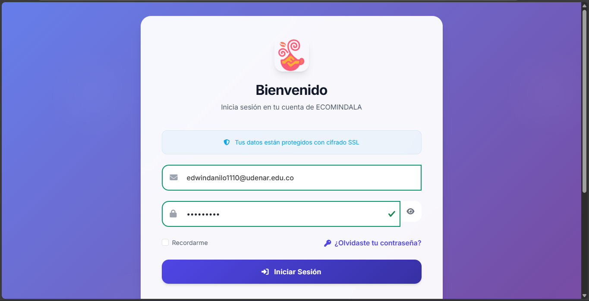

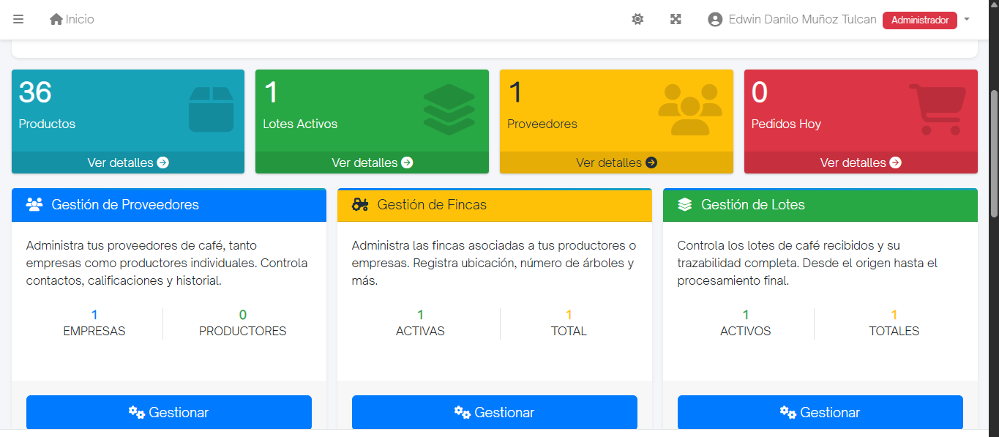

## Core business modules

Users
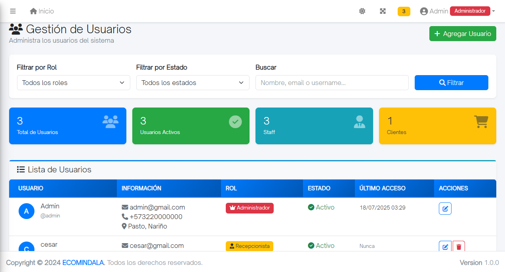

Inventory
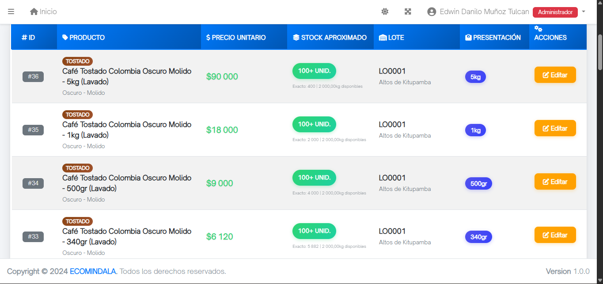

Coffe Lots
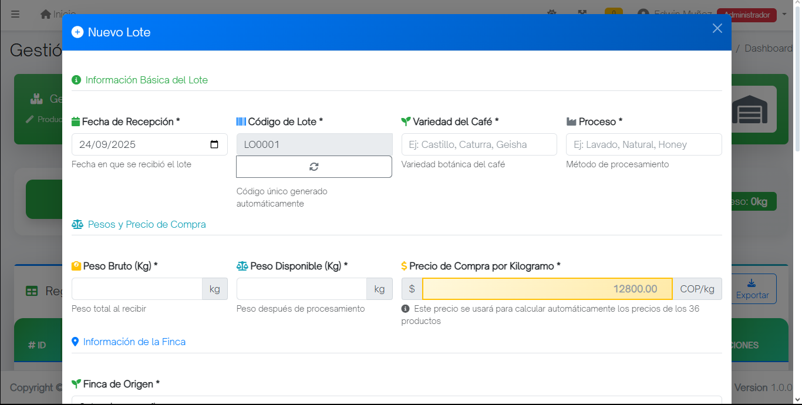
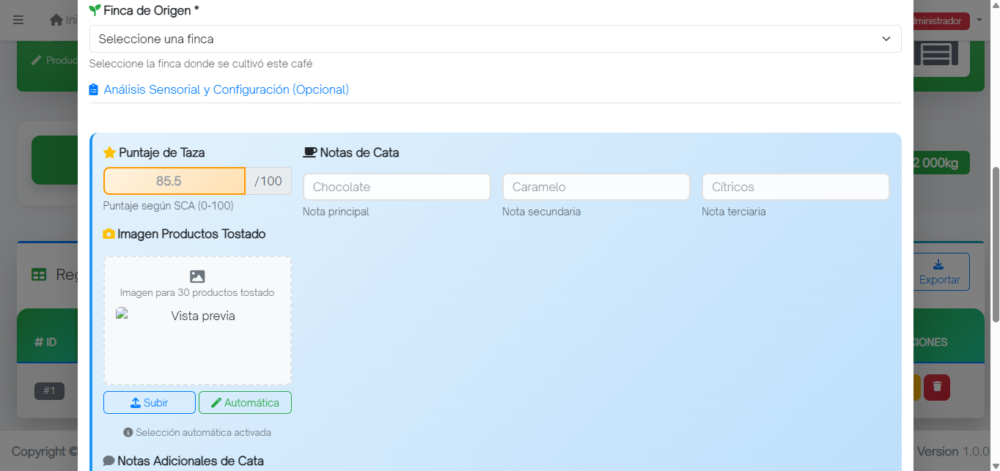
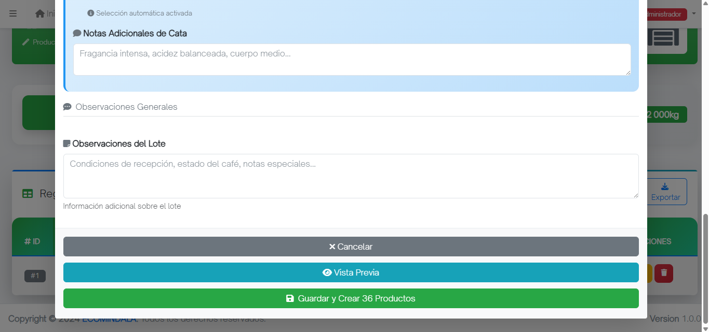

Movimientos y trazabilidad
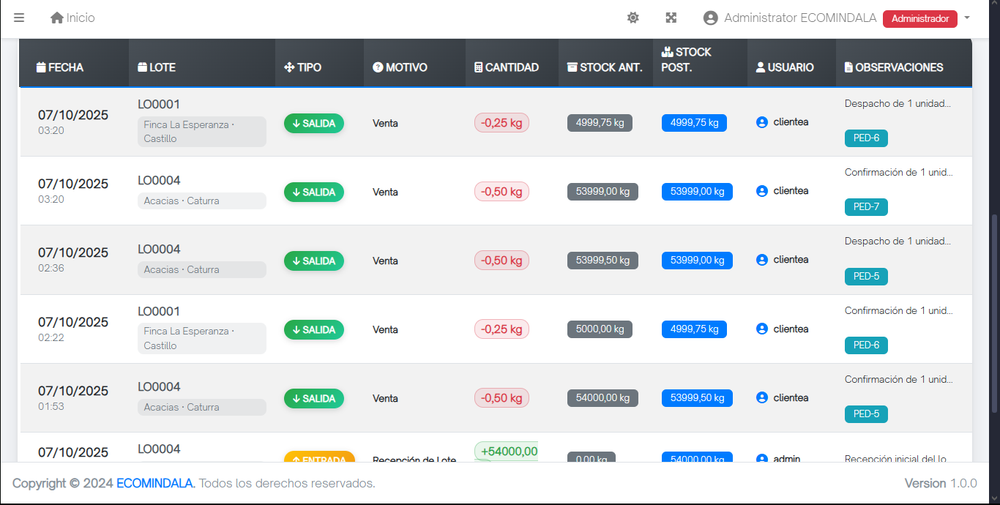

Orders
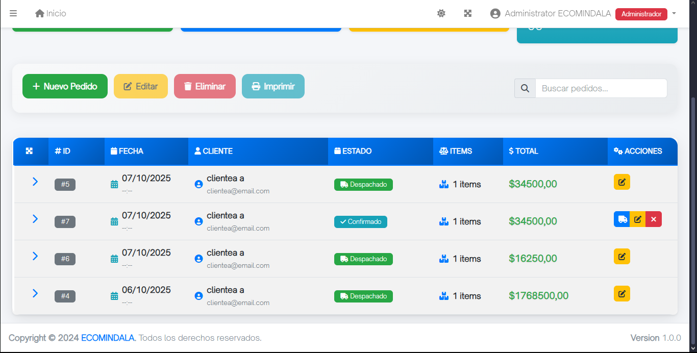

Suppliers
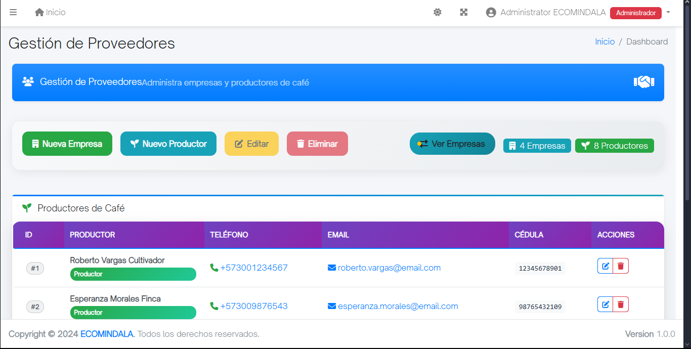

Reports
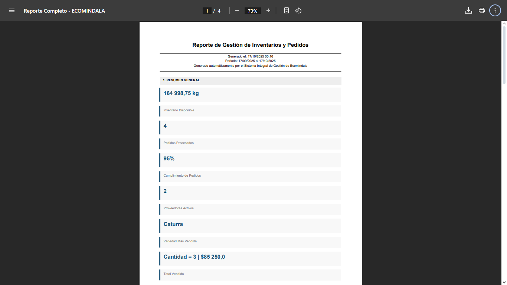
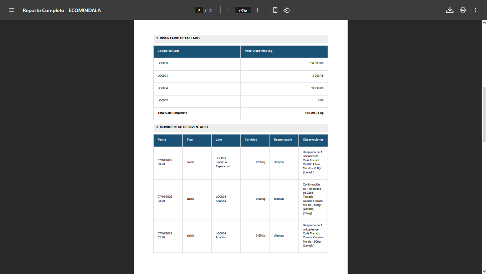
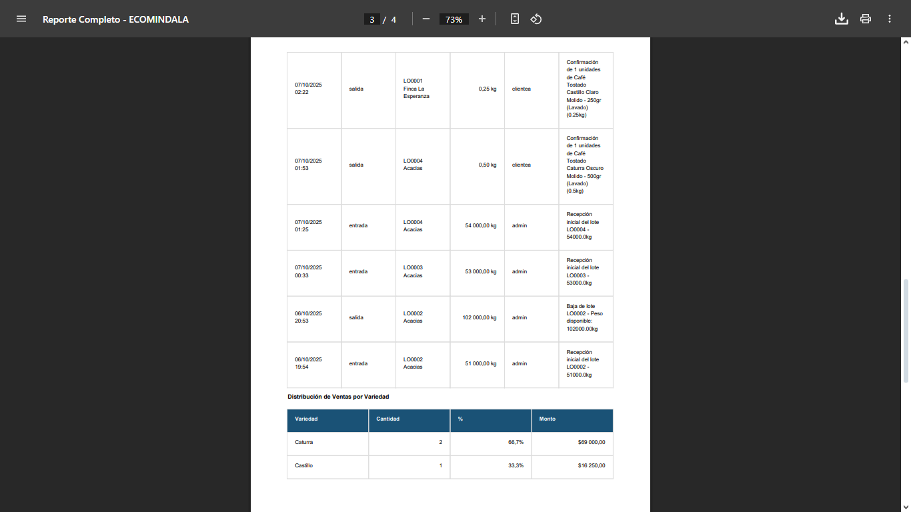
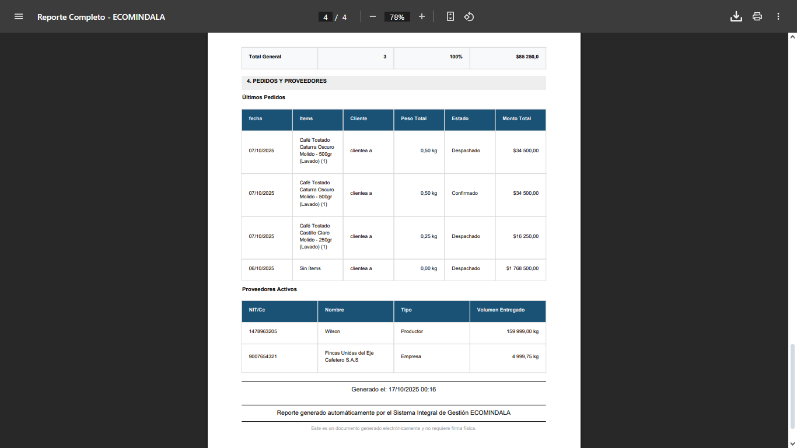

---

# Key Contributions

- Analyzed and documented business processes previously handled through verbal communication and paper records.
- Standardized operational workflows before digitizing them.
- Evaluated seven existing inventory management solutions using weighted technical criteria.
- Designed the software architecture and database model.
- Developed the internal inventory and traceability platform using Django and PostgreSQL.
- Implemented role-based authentication and authorization for four roles: Administrator, Receptionist, Dispatcher, and Customer.
- Designed an automatic product generation engine: registering one coffee lot creates all 36 sellable product variants (dried parchment, green, and roasted coffee across weights, roast levels, and whole-bean/ground forms) with automatically calculated pricing.
- Modeled inventory at the lot level: dispatching an order deducts each product's weight from the remaining weight of its own lot, adjusted by the processing loss (hulling or roasting) that applies to that presentation, and every change is recorded as an auditable inventory movement.
- Built the order management module: status lifecycle, stock validation, dispatcher workflow, and email notifications.
- Structured the sensory analysis of each lot (tasting notes, cup score, observations) so customers and staff can see each lot's flavor profile together with its origin data.
- Built reporting dashboards with PDF export.
- Validated the system through functional testing, pilot testing, and a user satisfaction survey with real users.

---

# Business Context

Ecomindala managed most of its daily operations manually.

Inventory movements, supplier information, product registration, and operational procedures depended on messages, handwritten records, and verbal communication.

This created several challenges:

- Lack of standardized processes
- Manual inventory tracking
- No centralized information
- Limited product traceability
- Human errors during daily operations
- Limited reporting capabilities
- No role-based access control

The objective of this project was not simply to build software, but to digitize and standardize the company's operational workflow.

---

# My Role

I worked as a Systems Engineering intern within the Research, Development, and Innovation area.

My responsibilities included:

- Business analysis
- Requirements engineering
- Process documentation
- Technology evaluation
- System modeling
- Database design
- Backend development
- User testing

### Project Scope

Another intern and I worked on the same Django project, with a clear split of responsibilities:

- **My part:** the internal management platform — users and roles, suppliers, farms, lots, automatic product generation, inventory, order management (status lifecycle, stock deduction, dispatch, notifications), and reports.
- **The other intern's part:** the customer-facing online store, including the shopping cart and the storefront views. We agreed together on how a lot's sensory analysis would be structured, and the store displays that information to customers.

---

# Before → After

| Before | After |
|---------|--------|
| Verbal operational procedures | Standardized digital workflows |
| Manual inventory records | Centralized, weight-based inventory with an auditable movement history |
| Manual product and presentation registration | 36 products generated automatically per lot, with calculated prices |
| No role separation | Role-based authentication and permissions |
| No coffee traceability | Supplier → Farm → Lot → Product traceability |
| Manual reporting | Inventory and operational reports with PDF export |
| Disconnected information | Integrated management platform |

---

# Research & Technical Decision

Before developing a custom solution, seven inventory management platforms were evaluated.

| Solution | Score |
|----------|------:|
| Odoo | 58.00 |
| Zoho | 54.75 |
| Factora POS | 52.00 |
| InvenTree | 48.75 |
| Inventory CGI5 | 48.00 |
| Inventory (Laravel) | 48.00 |
| Novatecs Excel | 30.75 |

Evaluation criteria:

- Functionality
- Cost
- Ease of use
- Scalability
- Security
- Technical support
- Reporting flexibility

Although commercial solutions achieved higher scores, none allowed the level of customization required by Ecomindala.

Therefore, a custom platform was developed using Django, PostgreSQL, and AdminLTE 3 (see [Technologies](#technologies)).

This approach eliminated licensing costs while allowing complete adaptation to the company's operational workflow.

---

# System Design

The platform was designed around the following core entities:

- Users (with roles)
- Suppliers (Companies and individual Producers)
- Farms
- Coffee Lots
- Products
- Orders and Order Items
- Inventory Movements

The traceability model connects every finished product back through its coffee lot, the farm of origin, and the supplier who registered it — giving Ecomindala full visibility from the source of the coffee to the final product. In addition, every stock change is stored as an inventory movement that references the lot, the user who made it, and the related order when there is one, so the history of each lot can be consulted at any time.

## Architecture

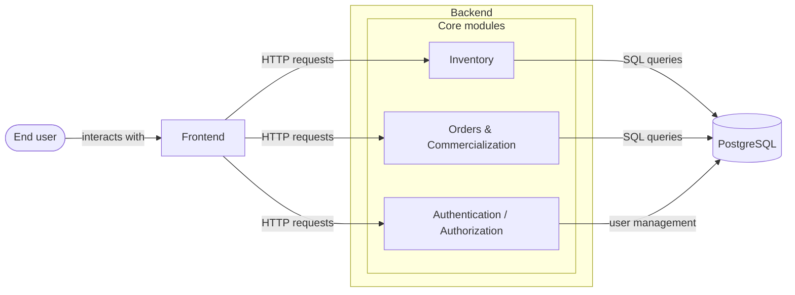

## Class Diagram

The model names are kept in Spanish because they mirror the domain language used by the company.

| Model | Meaning |
|---|---|
| `Empresa` / `Productor` | Supplier: company or individual producer |
| `Finca` | Farm |
| `Lote` | Coffee lot |
| `Producto` | Sellable product generated from a lot |
| `Pedido` / `ItemPedido` | Order / order item |
| `MovimientoInventario` | Inventory movement |
| `CustomUser` | System user, with a role |

Show class diagram

```mermaid
classDiagram
    class Empresa {
        String nombreempresa
        String nombregal
        String nit
        String email
        String telefono
        chk_nit_formato()
        chk_telefono_formato_emp()
        clean()
        save()
    }

    class Finca {
        String nombre
        String departamento
        String municipio
        String vereda_correg
        Integer numero_arboles
        Integer altura
        Integer propietario_content_type_id
        Integer propietario_object_id
        Object propietario
        clean()
        save()
    }

    class Productor {
        String nombre
        String cedula
        String telefono
        String email
        chk_cedula_formato_prod()
        chk_telefono_formato_prod()
        clean()
        save()
    }

    class Lote {
        DateTime fecha
        String codigo_lote
        Float peso_bruto
        String variedad
        String proceso
        Text analisis_sensorial
        Text observaciones
        Finca finca
        clean()
        save()
    }

    class MovimientoInventario {
        DateTime fecha
        Lote lote
        String tipo_movimiento
        String motivo
        Decimal peso_kg
        Decimal peso_anterior
        Decimal peso_posterior
        CustomUser usuario
        String observaciones
        String documento_referencia
        Pedido pedido_relacionado
        clean()
        save()
        actualizar_peso_lote()
        registrar_venta_lote()
        confirmar_pedido_movimiento()
        registrar_entrada_lote()
    }

    class CustomUser {
        String email
        String username
        String name
        String password
        Boolean is_active
        Boolean is_staff
        String rol
        DateTime date_joined
        DateTime last_login
        String cedula
        String telefono
        String municipio
        String depto_estado
        String pais
        clean()
        save()
    }

    class Producto {
        Decimal precio_unitario
        Lote lote
        String tipo_presentacion
        String peso_presentacion
        String tipo_tostado
        String tipo_molido
        Image imagen
        String nombre
        Boolean activo
        DateTime fecha_creacion
        clean()
        save()
        generar_nombre()
        get_precio_display()
        get_stock_disponible()
        obtener_presentacion()
        actualizar_stock()
        calcular_precio_total()
    }

    class ItemPedido {
        Pedido pedido
        Producto producto
        Integer cantidad
        Decimal precio_unitario_guardado
        String observaciones
        DateTime fecha_agregado
        save()
        clean()
        peso_total_kg()
        subtotal()
        agregar_al_pedido()
    }

    class Pedido {
        Date fecha
        CustomUser cliente
        String estado
        Decimal total
        Boolean esta_pagado
        String observaciones_pedido
        DateTime fecha_confirmacion
        DateTime fecha_despacho
        DateTime fecha_cancelacion
        confirmar_pedido()
        cancelar_pedido()
        _send_cancellation_email()
        despachar_pedido()
        calcular_total()
        get_cantidad_total_items()
        get_peso_total()
        tiene_items()
    }

    Empresa --> Finca
    Productor --> Finca
    Finca --> Lote
    Lote --> MovimientoInventario
    CustomUser --> MovimientoInventario
    Lote --> Producto
    Producto --> ItemPedido
    Pedido --> ItemPedido
    CustomUser --> Pedido
    MovimientoInventario --> Pedido
```

---

# How the Core Business Logic Works

## Automatic product generation

Registering a coffee lot automatically generates its **36 sellable products**, so staff never create presentations by hand. The presentation matrix comes from the manual "Presentation Registration" form defined during the business analysis phase:

| Form | Net weights | Options | Products |
|---|---|---|---|
| Roasted coffee | 250 g, 340 g, 500 g, 1,000 g, 2,500 g | 3 roast levels (light, medium, dark) × whole bean or ground | 30 |
| Green coffee | 35 kg, 50 kg, 75 kg | — | 3 |
| Dried parchment coffee | 35 kg, 50 kg, 75 kg | — | 3 |
| **Total** | | | **36** |

Not every weight applies to every form: the five smaller weights are only for roasted coffee, and the three largest are only for green and parchment coffee. Ground coffee uses a medium grind by default.

Prices are calculated automatically from the purchase price plus fixed margin rules (the values are not published here), and can be edited afterwards, along with names and images.

## Inventory and stock deduction

Stock lives at the **lot level**, as the remaining weight of each lot:

1. A customer builds an order that can mix products from different lots.
2. When the order is dispatched, the system deducts each product's weight from the remaining weight of **its own lot**.
3. Depending on the presentation, a loss percentage from hulling or roasting is also taken into account, so the lot's remaining weight reflects the real amount of raw coffee consumed.
4. Each deduction is stored as an inventory movement with the previous weight, the resulting weight, the user, the reason, and the related order.

## Lot characteristics and flavor profile

Each lot stores its sensory analysis as structured information: primary, secondary, and tertiary tasting notes, cup score, and observations. Together with its processing method (washed, natural, or honey) and the altitude and location of the farm of origin, this lets customers see what makes each lot unique from the online store, and lets staff consult it from the management platform.

---

# Features

## Authentication

- Email login with secure logout
- Role-based access for Administrator, Receptionist, Dispatcher, and Customer

## User Management

- Staff registration and full user management
- Role assignment

## Supplier Management

- Companies and individual producers
- Format validation for tax and national ID numbers and for international phone numbers

## Farm Management

- Farm registration with location, altitude, and number of trees
- A farm belongs to either a company or an individual producer

## Coffee Lots

- Lot registration with an automatic, unique sequential code
- Origin tracking back to the farm and supplier
- Informational fields per lot: reception date, packaging, variety, processing method (washed, natural, or honey), gross weight, and structured sensory analysis

## Product Generation

- 36 products generated automatically per registered lot
- Automatic price calculation, with editable prices, names, and images
- Active/inactive status and filters for product management

## Inventory

- Stock managed as the remaining weight of each lot
- Inventory movement dashboard with filters by type and reason, and summary metrics

## Order Management

- Order lifecycle: Cart → Confirmed → Dispatched → Cancelled
- Stock validation before confirming
- Administrator dashboard and Dispatcher dashboard
- Automatic email notifications on status changes
- Customer cart and storefront built by the other intern

## Reports

- Production, stock, supplier, and order analysis
- PDF export

---

# Technical Highlights

- **Flexible farm ownership:** farms use a generic relation so each one belongs to either a company or an individual producer, with exclusive ownership enforced.
- **Auditable inventory:** no weight changes without a movement record that stores the previous and resulting weight.
- **Role enforcement:** access is restricted per role with custom decorators on every protected view.
- **Domain validation:** tax and national ID formats, international phone formats, positive weights, and numeric and geographic checks.
- **Responsive, dynamic UI:** AJAX-loaded selects (for example, farms load by supplier without reloading the page), modals with SweetAlert2 feedback, and light/dark mode.
- **Atomic operations** when registering related records.

---

# Development Process

The project followed the Scrum framework, organized into 8 sprints derived directly from the prioritized product backlog:

| Sprint | Scope |
|---|---|
| 1 | User registration, supplier management, farm management (Administrator role) |
| 2 | Lot management, product management |
| 3 | Authentication (email login with role-based access) |
| 4 | Supplier registration, farm management, and lot intake (Receptionist role) |
| 5 | Order management (Administrator role) |
| 6 | Automatic product generation from lots, order dispatch (Dispatcher role) |
| 7 | Inventory consultation |
| 8 | Reporting |

---

# Validation

The system was evaluated through:

- Functional testing
- Pilot testing
- A user satisfaction survey

Pilot testing involved real users representing the system's operational roles, validating:

- Role-based access
- Inventory workflows
- Order management
- Coffee traceability
- Overall usability

An important outcome was that the manual forms designed during the initial business analysis phase closely matched the final software interface. Because the system was modeled directly on those forms, the transition from physical to digital records felt familiar to users rather than disruptive — reducing the learning curve during adoption.

---

# Proposed KPIs

As part of the project, a set of inventory management KPIs was designed and formally validated with the project stakeholders for future operational monitoring:

- Inventory accuracy
- Inventory turnover
- Order accuracy
- Backorder rate
- Days in inventory
- Picking and packing cycle time
- Return rate
- Fill rate

> These indicators were **designed but not measured**.
>
> At the end of the project, Ecomindala did not yet have sufficient historical operational data to calculate these KPIs. They were proposed as a future monitoring framework for the company.

---

# Screenshots

Users

*(Image)*

Suppliers

*(Image)*

Login by role

*(Image)*

Lots, with sensory analysis

*(Image)*

Automatically generated products

*(Image)*

Orders

*(Image)*

Inventory movements

*(Image)*

Reports

*(Image)*

---

# Technologies

- Python
- Django
- PostgreSQL
- AdminLTE 3
- Bootstrap 5
- HTML
- CSS
- JavaScript (AJAX)
- SweetAlert2
- SMTP email notifications
- PDF export (xhtml2pdf)

---

# Lessons Learned

This project demonstrated that successful software engineering begins with understanding business processes rather than writing code.

Some of the most valuable lessons include:

- Standardizing workflows before digitization.
- Evaluating existing solutions before deciding to build.
- Designing systems around business processes.
- Preserving product traceability through data modeling.
- Validating software with real end users throughout the project.

---

# Academic Context

This project was developed as my undergraduate thesis in Systems Engineering at the University of Nariño under the **Social Interaction Internship** modality.

Unlike a purely academic assignment, the project was carried out within a real company, addressing real operational challenges through the analysis, design, and development of a complete software solution.
